# RGB_board

Simple 3V board design with tact switch and potmeter to control a RGB LED for a workshop I developed at ArtechLAB Amsterdam for Museum M in Almere. 

 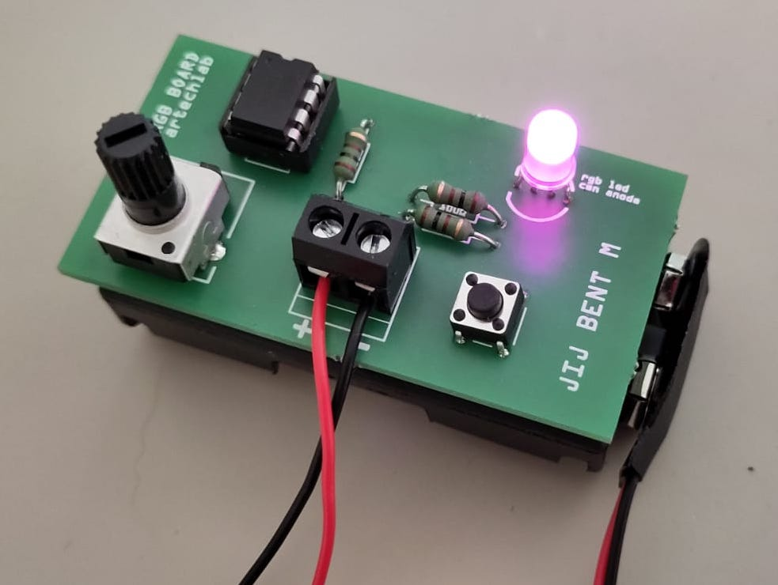 

## Description

This board runs on 3V and is also the size of a 2x AA battery pack. It features an attiny85 microcontroller, a potentiometer, a tact switch and a common anode RGB LED. 

With the tact switch different color modes can be selected (red, green or blue). Within each color mode, the intensity can be modified by turning the potentiometer knob. 

It was designed for a high school workshop to engage teenagers in immersive designs by playing with lighting and paper structures. 

## Bill of materials

### Tools

**Arduino IDE with following installed**
 
* ATtiny microcontrollers boards (via board manager, see below) 
* The arduino sketch under "files" in this repository [RGB_attiny_pot_switch_3V.ino](./files/RGB_attiny_pot_switch_3V/RGB_attiny_pot_switch_3V.ino) 
* Sparkfun tiny AVR programmer [€22 via robotshop](https://eu.robotshop.com/products/tiny-avr-usb-programmer).

You could also program the ATtiny with an Arduino UNO microcontroller, a breadboard, and a bunch of dupont jumpers. [See this instructable](https://srituhobby.com/how-to-program-attiny85-with-arduino-uno-step-by-step/)

**Hand tools**

* Small flathead screwdriver to connect battery leads to screw terminal
* Soldering iron and solder
* Multimeter

### Components per board

* [Solderable screw terminal (2 ports)](https://www.reichelt.nl/nl/nl/loetbare-schraubklemme-2-pol-rm-5-mm-90--ctb5202-2-p292669.html?&trstct=pol_12&nbc=1)
* [3x 100 ohm resistors](https://www.reichelt.nl/nl/nl/koolstoffilmweerstand-1-4w-5-100-ohm-1-4w-100-p1336.html?&nbc=1)
* [Attiny85 chip (DIP)](https://www.reichelt.nl/nl/nl/8-bit-attiny-avr-risc-microcontroller-8-kb-20-mhz-dip-8-attiny-85-20-pu-p69299.html?&nbc=1)
* [9V battery clip](https://www.reichelt.nl/nl/nl/batterijclip-voor-9-volt-blok-verticaal-clip-9v-p6665.html?&nbc=1)
* [Battery holder 2x AA mignon batteries with connector that matches the battery clip](https://www.reichelt.nl/nl/nl/houder-voor-2-mignoncellen-aa-drukknop-halter-2xum3-dk-p8438.html?&trstct=pol_1&nbc=1)
* [RGB LED (common anode)](https://opencircuit.nl/product/rgb-5mm-diffuse-led-common-anode)
* [Potentiometer ](https://opencircuit.nl/product/10k-rv09-verticale-potentiometer)
* [Tact switch 6 mm](https://opencircuit.nl/product/tactiele-button-6x6x5mm)
* The printed circuit board (PCB) (this design can be ordered [here](https://aisler.net/p/CUOELNLM))
* [2x AA batteries](https://www.reichelt.nl/nl/nl/set-van-40-batterijen-alkaline-mignon-ansmann-ans-al40-pack-p104406.html?&trstct=pol_6&nbc=1)

## Board design

 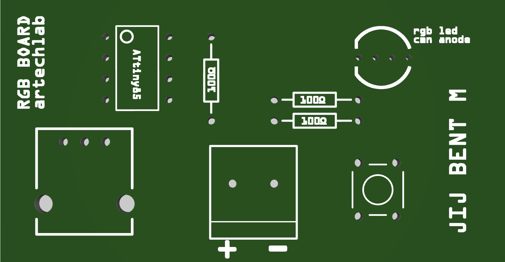 

 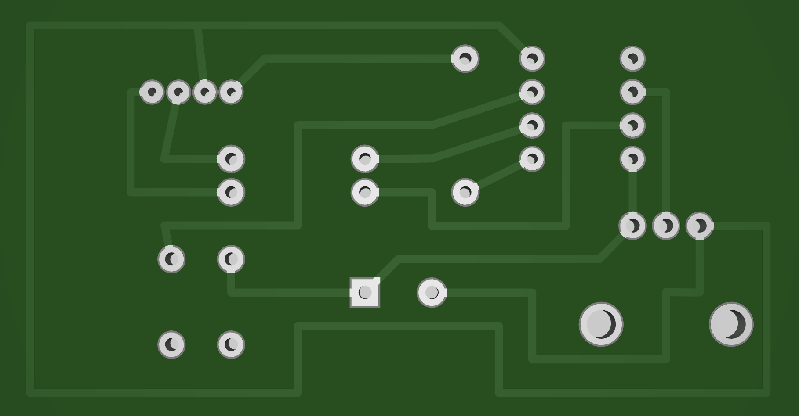 

## Programming the ATtiny85 chip

 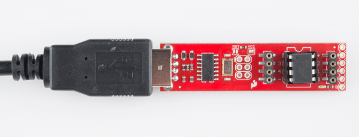 

### Install the [Arduino IDE](https://www.arduino.cc/en/software) software

* Download and open the sketch: [RGB_attiny_pot_switch_3V.ino](./files/RGB_attiny_pot_switch_3V/RGB_attiny_pot_switch_3V.ino)

	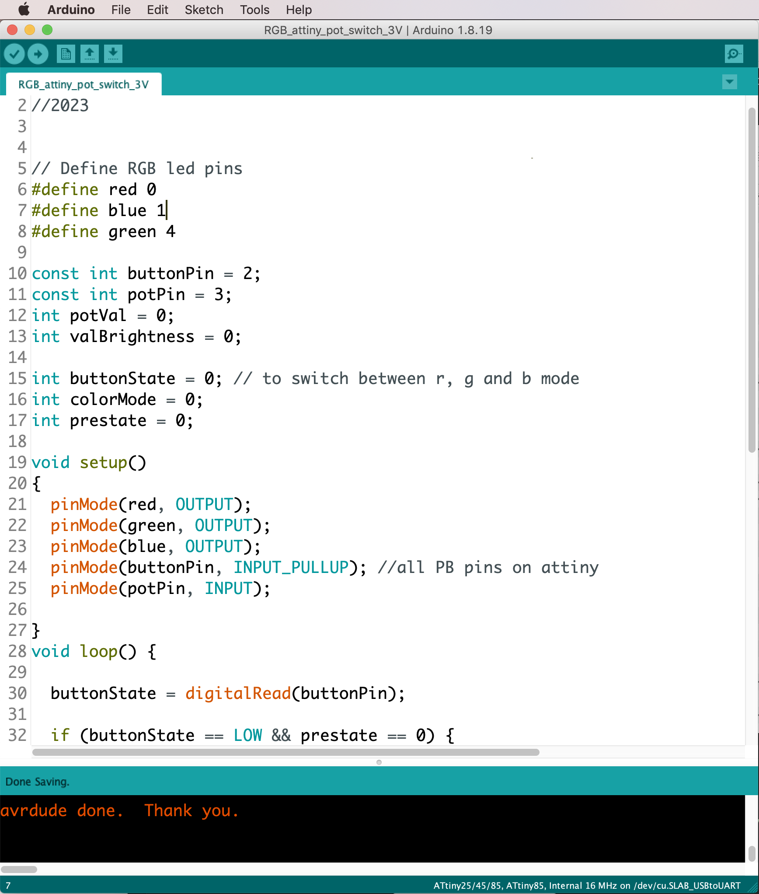 

### Install the ATtiny board files 

Find via the menu bar *> Tools > Board > Board Manager...*  and search for **"attiny"**. Then click **"install"**.

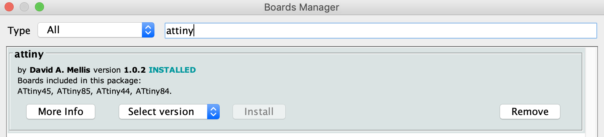 

* Restart the Arduino IDE software and reopen it
* Now you should find **ATtiny microcontrollers** under *Tools > Board*. 

### Selecting the board and programmer

Select **ATtiny25/45/85**

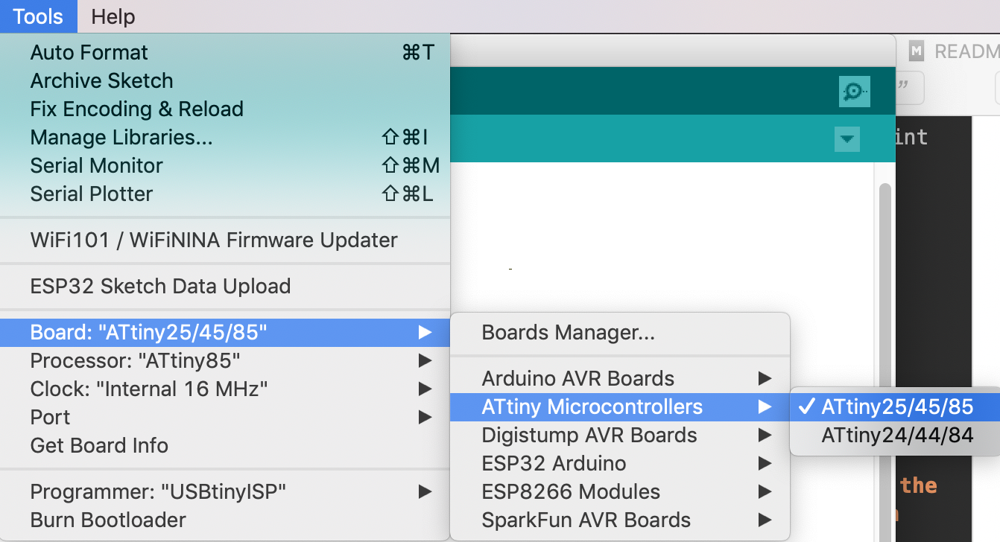 

Select the right board settings as in the screenshot

* Board = ATtiny25/45/85
* Processor = ATtiny85
* Clock = Internal 1MHz
* Programmer = USBtinyISP

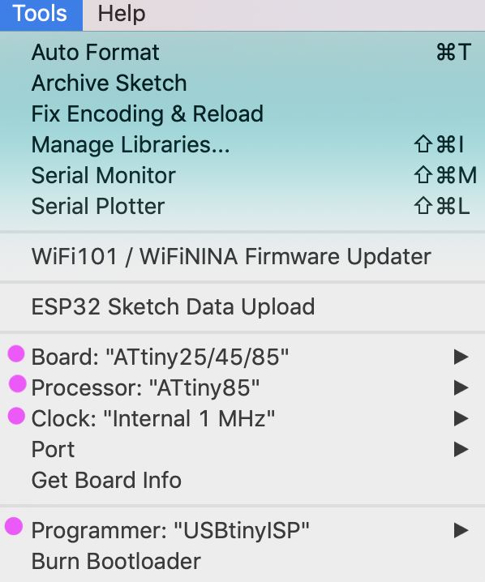 

### Upload the code via the programmer

* Carefully plug the ATtiny85 chip into the socket on the board. 
	* Make sure the mark on the chip is in the right direction!

	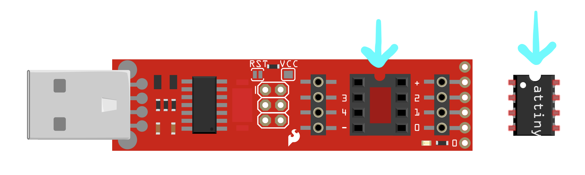 
	
* Plug the stick into your computer's USB port and select >> **Sketch** >> **Upload** from the menu. The monitor should say "avrdude done. Thank you"

	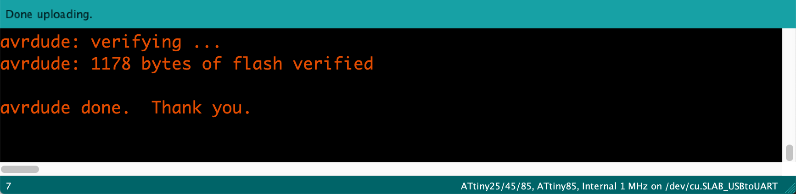 

* The Attiny chip has now been programmed

## Assembly

### 1. Program the ATtiny chip before sholdering

See above

### 2. Stuffing the board

Solder all parts to the boards following this diagram. Note the orientation of the following: 

* the long leg on the RGB is the common anode and goes into the second hole of the led footprint
* note the notch on the attiny85 chip, it marks the orientation and should point in the same direction of the little circle in the silkscreen of the footprint
* glue or tie the battery pack to the board, screw the wires into the screw terminal. The red lead goes to the + and the black lead goes to the -. 

 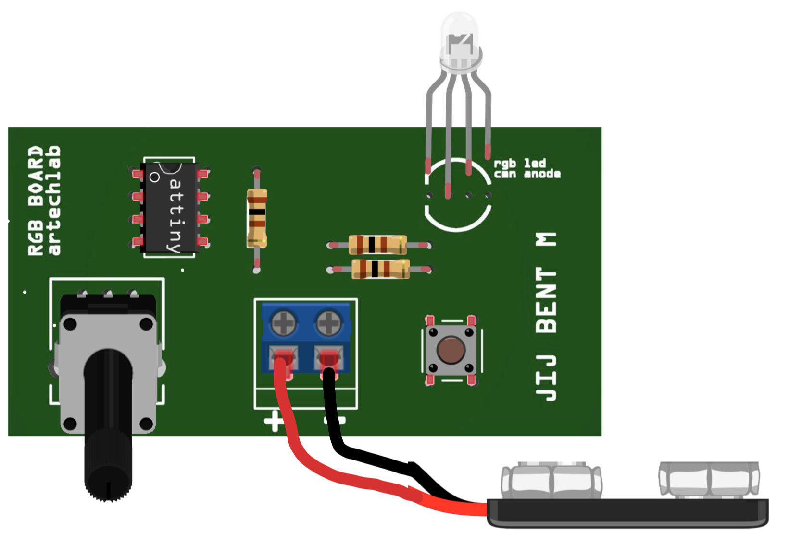 

 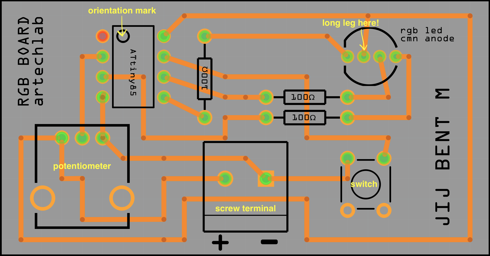 

### Testing

* I made one board with a 8-pin DIP socket to test the chips without soldering
* Take the chip out and replace with the Attiny we just programmed
* Connect the battery
* Check if everything works (color changes with tshe knob and switch)

[Example video here](./files/test/mp4)

## Disconnect the battery to power off!

**NOTE: To turn off the board: disconnect the battery. Although you can turn off the LED with the potmeter, the chip will continue running and drain the battery. When done: switch it off.s**

## Workshop tutorials

in Dutch only: 

* [Ontwerpinstructies](./files/slides-lichtkunst-workshop.pdf)
* [Docentenhandleiding](./files/docentenhandleiding.pdf)
* [Powerpoint slides](./files/instructiebladen_solderen.pdf)
* [Soldeerinstructies](./files/instructiebladen_vormgeving.pdf)
